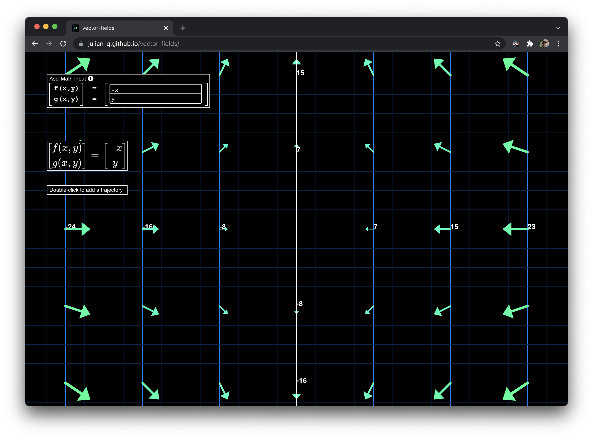

# vector-fields

This is a simple vector field / differential equation plotter I made, [hosted here](https://julian-q.github.io/vector-fields/)! You can edit the field it displays by modifying the text boxes in the top left corner and pressing `Enter`. It uses [AsciiMath](http://asciimath.org/) syntax, but there is a LaTeX (via [MathJax](https://www.mathjax.org/)) rendering too so you can make sure you typed everything correctly. You can also scroll in and out with the scroll wheel. If you double click somewhere, it will plot a "solution trajectory" to the differential equation represented by the vector field, using [Euler's method](https://en.wikipedia.org/wiki/Euler_method) with a step size of `0.01` and `1000` total steps.
